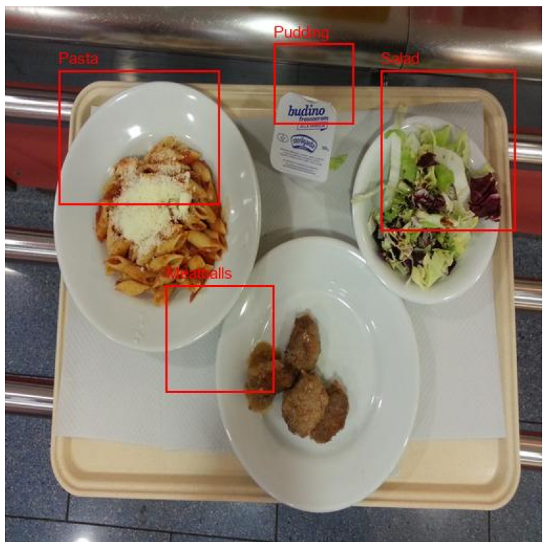

# Bounding box example 1
*Data* - 
*Output* - 
## Data Response 
```shell
image_dimensions=[512, 512] food_items=[FoodItem(name='Pasta', macros=Macros(protein=7.0, fat=4.0, carbs=40.0), calories=250, bounding_box=BoundingBox(x1=0.1, y1=0.12, x2=0.42, y2=0.48), confidence=0.95), FoodItem(name='Salad', macros=Macros(protein=1.0, fat=0.0, carbs=5.0), calories=25, bounding_box=BoundingBox(x1=0.56, y1=0.2, x2=0.88, y2=0.48), confidence=0.9), FoodItem(name='Meatballs', macros=Macros(protein=12.0, fat=18.0, carbs=10.0), calories=250, bounding_box=BoundingBox(x1=0.35, y1=0.52, x2=0.65, y2=0.8), confidence=0.92), FoodItem(name='Pudding', macros=Macros(protein=3.0, fat=10.0, carbs=25.0), calories=190, bounding_box=BoundingBox(x1=0.58, y1=0.02, x2=0.78, y2=0.18), confidence=0.88)]
```

# Example 1
*Data* - 
## Response 
1. **Meatballs (approx. 3 small meatballs)**:
   - **Calories**: ~150-200
   - **Protein**: ~15-20g
   - **Fat**: ~10-15g
   - **Carbohydrates**: ~5g

2. **Pasta with tomato sauce and cheese (approx. 1 cup)**:
   - **Calories**: ~300-400
   - **Protein**: ~10-15g
   - **Fat**: ~10-15g
   - **Carbohydrates**: ~50-60g

3. **Side salad (small bowl)**:
   - **Calories**: ~50-100 (depending on dressing)
   - **Protein**: ~1-2g
   - **Fat**: ~2-5g (more if dressing is included)
   - **Carbohydrates**: ~5-10g

4. **Butter or margarine packet**:
   - **Calories**: ~50-100
   - **Fat**: ~5-10g

### Estimated Totals:
- **Total Calories**: ~550-800
- **Total Protein**: ~26-37g
- **Total Fat**: ~27-45g
- **Total Carbohydrates**: ~60-75g

# Example 2
*Data* - 
## Response 
Based on your description, the food items appear to be:

1. **Protein Source**: Likely chicken or fish, baked or boiled.
2. **Carbohydrate Source**: Mashed potatoes.

### Estimated Macros and Calories

1. **Protein Item (Chicken/Fish)**:
   - **Serving Size**: About 100-150 grams.
   - **Estimated Macros**:
     - **Protein**: 25-30g
     - **Fat**: 3-7g
     - **Carbs**: 0g
   - **Calories**: Approximately 150-200 calories

2. **Mashed Potatoes**:
   - **Serving Size**: About 150-200 grams.
   - **Estimated Macros**:
     - **Protein**: 2-4g
     - **Fat**: 5-8g (depending on preparation method)
     - **Carbs**: 30-40g
   - **Calories**: Approximately 150-200 calories

### Total Estimated Macros
- **Total Protein**: 27-34g
- **Total Fat**: 8-15g
- **Total Carbs**: 30-40g
- **Total Calories**: Approximately 300-400 calories